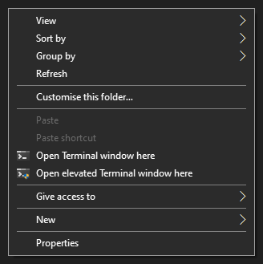
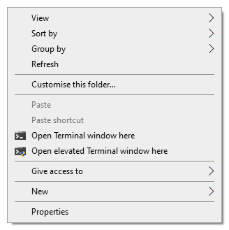

# windows-terminal-context-menu
A simple app to add Windows Terminal context menu entries to Windows Explorer.

## Example screenshots:

### Install:
Download and run the latest installer [here](https://github.com/ContentPersonality2/windows-terminal-context-menu/releases/download/v1.1/windows-terminal-context-menu.exe).

### Deinstall:
Deinstall as you would any other Windows 10 app. Search for windows-terminal-context-menu in your Windows 10 apps list.
